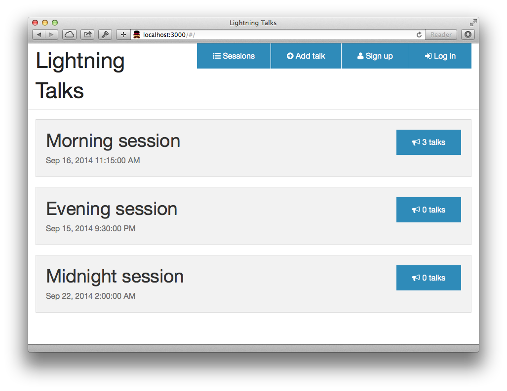
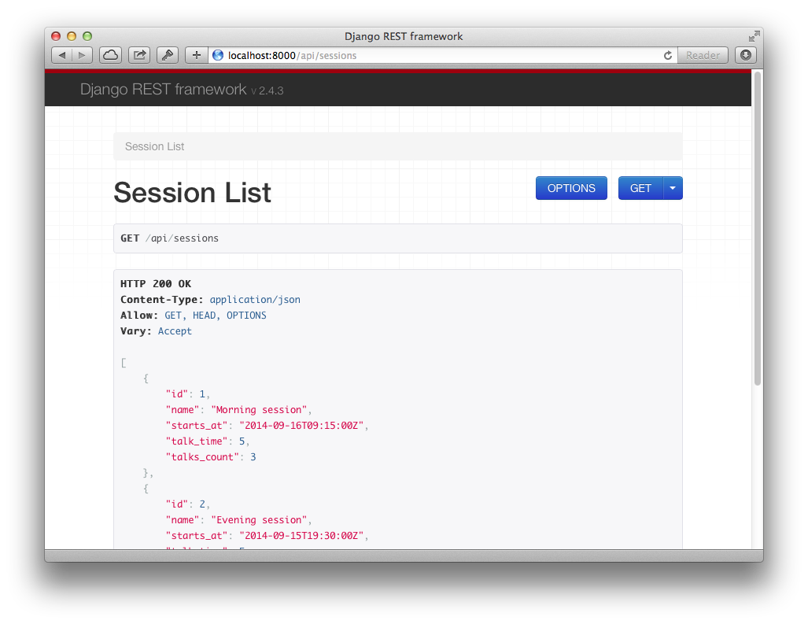

# How it works

## Frontend

After running `gulp` command browser should be opened and you should see a session
list, similar to the one from Figure 1.



### URL handler

Let's have a look at (simplified) Angular application definition.

```javascript
angular.module('lightningtalks', ['ngRoute'])
  .config(function ($routeProvider, $httpProvider) {

    $routeProvider
      .when('/', {
        templateUrl: 'partials/sessions/session-list.html',
        controller: 'SessionListCtrl'
      });
```

What's important here is `$routeProvider.when` method. We can seee that `/` url
is bound to the `session-list.html` template and is handled by `SessionListCtrl`.

We will describe briefly what's going on on a template.

### The View

Here is our `session-list.html` template's content (again, simplified):

```html
<div class="sessions">
  <ul class="sessions__list">
    <li class="sessions__item" ng-repeat="session in sessions">
      <h2>{{ session.name }}</h2>
    </li>
  </ul>
</div>
```

Note that cryptic `ng-repeat="session in sessions"` attribute declaration at
the `li` element.  It means that `li` element should be repeated for each item
within `sessions` object. We might assume that this object is an array of
session objects.

> Tip: Angular provides some helpers to get the *scope* of an HTML element. You
> can open developer tools in your browser and type into console:
> `angular.element('.sessions__list').scope()` to see a Javascript object that
> is bound to the element.

But how was that `sessions` set on the scope?

### The Controller

Firstly let us have a look at the controller's code:

```js
angular.module('lightningtalks')
  .controller('SessionListCtrl', function ($scope, Session) {
    $scope.sessions = Session.query();
  });
```

Actually, there is not much going on here. In fact, our controller is
responsible only for setting `sessions` object at the `$scope`. So our
`sessions` is the result of the `Session.query()` method call. And the
`Session` object is an custom *service* which defines the model.

### The Model

In our example model is a result of the API endpoint call. AngularJS provides
low level `$http` object for communication over HTTP, however it also gives us
a nice API resources wrapper. At `session-service.js` file we can see something
similar to:

```js
angular.module('lightningtalks')
  .service('Session', function ($resource) {
    return $resource('http://localhost:8000/api/sessions/:id');
  });

```

With that service definition we can use `Session` object and it's methods to
talk with our API server.

## Backend

We already know how the frontend works so now is the time for the API backing
our application. We use Django Rest Framework for creating API endpoints.




### URL handler

At `lightningtalks/urls.py` we can find how URLs are handled.

```python
from django.conf.urls import patterns
from django.conf.urls import url
from talks import views as talks_views

urlpatterns = patterns('',
    url(r'^api/sessions$', talks_views.SessionListView.as_view()),
)

```

From the above code we can see that calls to the `/api/sessions` are handled by
the `SessionListView`.

### The Controller

Let's have a look at the code first.

```python
from .models import Session
from .serializers import SessionListSerializer
from rest_framework import generics

class SessionListView(generics.ListAPIView):
    model = Session
    serializer_class = SessionListSerializer
```

These few lines tell us that `SessionListView` operates on `Session` model and
uses `SessionListSerializer` for managing (de)serialization.

> Note that our view *extends* more generic `ListAPIView`. Read more here:
> http://www.django-rest-framework.org/api-guide/generic-views#listmodelmixin

### The Model

Our `Session` model is pretty simple. Table should store the information on the
session name and start time. In addition we want to store information on how
long each talk should be (with default value of 5 minutes).

```python
from django.db import models


class Session(models.Model):
    name = models.CharField(max_length=64, default='Lightning Talks')
    starts_at = models.DateTimeField()
    talk_time = models.PositiveSmallIntegerField(default=5)
```

> Hint: Django automatically adds a primary key field under `id` attribute if
> we don't specify any.

### The Serializer

Serialization is the heart of the API: it tells which objects should be
transformed into what. Our serializer must fetch `Session` objects from the
database and return proper data that would be then transformed into JSON.


```python
from . import models import
from rest_framework import serializers


class SessionListSerializer(serializers.ModelSerializer):
    talks_count = serializers.Field(source='talks.count')

    class Meta:
        model = models.Session
        fields = (
            'id',
            'name',
            'starts_at',
            'talk_time',
            'talks_count',
        )

```

As Django Rest Framework can introspect Django models, we don't need to write
the *serialization* code. We are defining list of fields that should be
returned by the serializer, though. In addition, we define our own field for
the serializer. Note that `talks_count` is a name of the serializer field, not
model field. It however points to the model's source field (`talks.count`).
Source fields might be simple attributes or methods.
